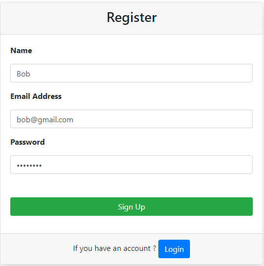
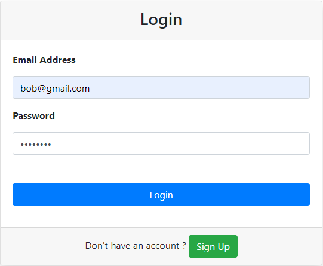
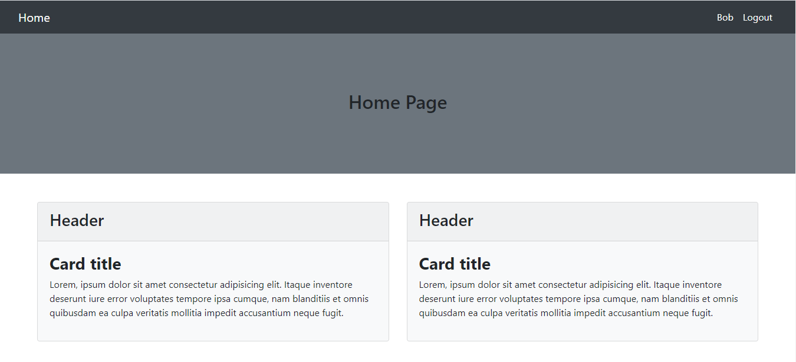

# Getting Started
## Database Import 
### From SQL Server

Import `testing.sql` file in your SQL Server.

### From SQL command line

```
mysql> use db_name;
mysql> source backup-file.sql
```

# Register

- [Register](#register)
- [Login](#login)
- [Home](#home)
- [Logout](#logout)

## Register
Here is a register page. Must be fill all input field `name`,`email`, and `password`. Show error message if something is left. After register, this record is saved to `users` table of database and redirect to home page.
    


## Login

Here is a login page.When email and password is equal to the records from `users` table, redirect to home page. It should not access after logged in. Show error message if email or password is incorrect. 



## Home

Here is home page. It can be access after logged in or register. It should not access without logged in or register.



## Logout

Logout and redirect to login page.
